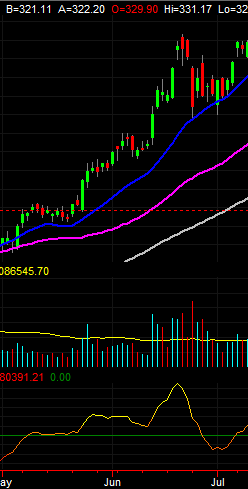

# BeTefex Perfect Matching: Futures and Combinations

## Summary 

The BeTefex Perfect Matching technology computes prices and trades, at arbitrary distance and depths, in combination markets. That is, it offers:
1. Extremely *high performance*, competitive with state-of-the art matching engine cores while offering much richer implied pricing.
2. *Correct pricing* (i.e. baits) across any number of combination books: i.e. trades which can only be found across multiple spreads, bundles and user-defined combinations at once.
3. Configurable *arbitrary depth,* computing the available volume at each price below the top. Additionally, *resolves volume constraints* (e.g. resolving the use of an interspread requiring a multiple of 10 volume to execute combining with a bait for a volume of 9 across another implication path).

## The use cases
This technology is useful in a number of different settings:
1. As the central technology for *operating a market* with complex combinations.
2. For *sophisticated participants* in combination markets the technology can be used to in real time find prices and possible trades not reported or detected by the matching engine used by the market operator.
3. As a *reference implementation* when evaluating or implementing markets of this type.

## In-depth background
The classic setting for the BeTefex Perfect Matching technology is in *futures markets with combinations.* We can use the Australian stock exchange Trade24 market as an example: large series of interest rate, equity index and commodity futures. These are then all connected up with a variety of combination contracts: for example *intraspreads*, e.g. a contract which *buys* a contract for electricity delivered in November and *sells* a contract for electricity delivered in December (i.e. equivalent to storing electricity for a month).

In some markets all such contracts are independently traded (i.e. the price of the combination is not directly affected by the price of the contracts involved), in many there are *single-step implications*: a price and trade may be found if a participant wants to sell electricity in November, another wants to buy electricity in December, and a third wants to buy the storage contract described above. For example Trade24 is much more sophisticated still, able to chain *any number of intraspreads* (and some *interspreads*) together to reveal better prices and trades. Even there not all prices and trades made possible by combining interspreads and/or complex combinations (*bundles*, *butterflies*, etc.) are not found however.

BeTefex Perfect Matching is a novel real-time solution for computing prices and trades across *all* combinations at arbitrary distance (number of combination types involved) and depth. This not only reveals trades which might not otherwise have been found, but reveals correct pricing for all books and at depth, allowing less sophisticated participants to trade with confidence.

## Technology

The BeTefex Perfect Matching technology is driven by *advances in logic solvers* (SMT using CDCL with custom theories) combined with *GPU acceleration.* A whitepaper giving a further overview of what a "perfect" market is, and describing the logics side of how the BeTefex Perfect Matching technology achieves it, is available [here.](betefex_whitepaper.pdf)
