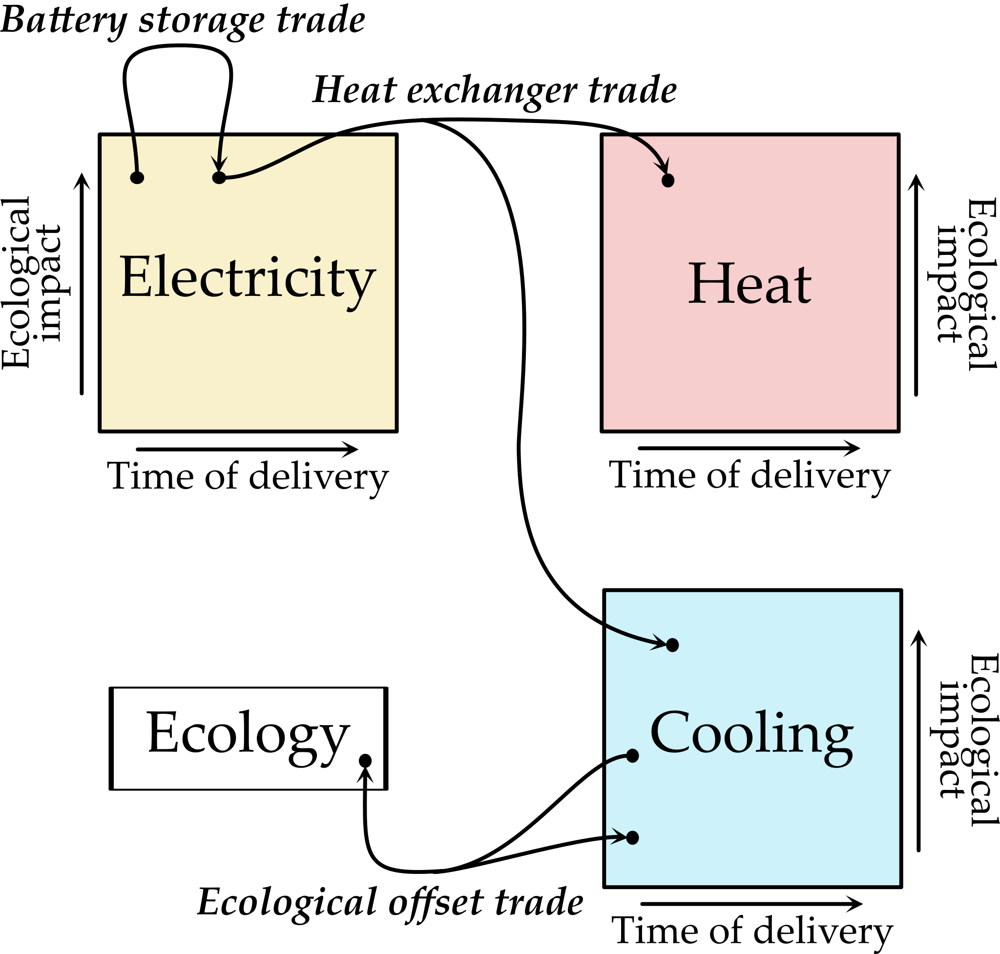

# BeTefex Perfect Matching: Energy markets and ecological concerns

Microgrids and ecological concerns are making energy markets more complex.

*Vastly more (indirect) participants, e.g.:*
 * Individuals renting out EV battery capacity
 * New construction with solar panels selling excess
 * Office building cooling early morning to make value out of thermal inertia

*Ecological aspects should be priced and traded:*

 * Piecemeal ecological ratings often obscure real costs (e.g. purchase of electricity for green heating is often poorly controlled)
 * Green electricity used to heat and cool makes correspondingly green thermal energy
 * The market can be used to price ecological effects, synthesize ecological offsets, and enforce *real* change

The result: a market of many interconnected products. Two example contracts:
 1. An individual with an electric car unused after 16:00 sells contract which *buys* electricity for delivery in the afternoon, and sells the same electricity for delivery overnight. The individual gets paid for the battery storage, and solar cell energy is saved to be used at night.
 2. A company operating a heat exchanger can sell contracts that *buy* green electricity, *sell* green cooling, *sell* regular heat, and *sell* an ecological offset. The ecological offset is created since the heating sold is green, but is sold as regular, so this extra ecological benefit is created.

Such a market is very complex since the contracts interconnect, e.g. the heat exchanger company may buy electricity stored in electric car batteries, the ecological offset is then bought as part of another trade, and so on. This is the problem the BeTefex Perfect Matching solves, computing the best (cheapest, highest-priority, optionally most ecological) possible way of making trades happen.

As part of this BeTefex Perfect Matching computes the prices and ecological effects for all possible contracts (at depth, i.e. by total amount traded). This is important, as even unsophisticated market participants can then achieve their desired trades with confidence.